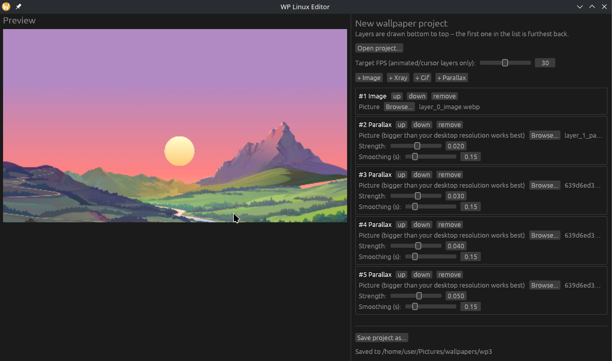

# WP Linux

*[Читать на русском](README_RU.md)*

<p align="center">
  
</p>

An animated, interactive wallpaper engine for Linux -- a Wallpaper Engine-style
alternative for **KDE Plasma 6 on Wayland (KWin)**. Build a layer stack
(static pictures, looping GIFs, cursor-reactive "xray"/parallax overlays) in a
small GPU-accelerated editor, then run it as your desktop wallpaper.

## Screenshots

<p align="center">
  
  
</p>

Parallax layer in action, reacting to the cursor on the real desktop:

[paralax_preview.webm](https://github.com/user-attachments/assets/04d47d50-a1a5-4c80-b399-aed54b54ba50)

<p align="center"><sub>
Artwork in the parallax demo above is from the
<a href="https://webflow.com/made-in-webflow/website/parallax-template-cloneable">Webflow parallax template</a>,
used here for demonstration only -- not original work, all rights remain with its creators.
</sub></p>

## Status

Early stage, single-platform: **KDE Plasma 6 + KWin/Wayland only**. Nothing
else (X11, GNOME, other compositors) is supported or planned right now.

## Features

- **Image** layers -- a static picture.
- **Gif** layers -- a looping animation, timed from the gif's own per-frame
  delays.
- **Xray** layers -- a base picture with a second picture revealed in a
  circle around the cursor, using the compositor's true global cursor
  position (works correctly even under desktop icons, which would otherwise
  swallow mouse hover from a normal window).
- **Parallax** layers -- a picture that pans opposite the cursor to fake
  depth; stack several with increasing strength for a full parallax effect.
  Auto-zoomed just enough that no edge is ever exposed, regardless of the
  source picture's own size.
- Layers composite bottom to top with alpha blending on the GPU (wgpu,
  Vulkan or GL).
- Rendering automatically freezes on the last frame when the system's power
  profile switches to power-saver (via `power-profiles-daemon`), and resumes
  when it switches back -- nothing to pause by hand.
- Prefers the integrated GPU over a suspended discrete GPU on hybrid-GPU
  laptops, avoiding a multi-hundred-millisecond wake-up on every frame.
- `editor` has a live GPU preview built from the exact same compositor and
  shaders `render-server` uses in production, not a separate
  reimplementation -- gif animation and xray cursor reactivity look right
  while you're still editing.

## How it's put together

| Component | What it does |
|---|---|
| `crates/project-format` | Shared `project.json` schema (layers + target fps) -- the on-disk wallpaper project format. |
| `crates/player` | Shared GPU compositor library (`SceneRenderer`) used by everything below, plus its own standalone Wayland/layer-shell test binary. |
| `crates/render-server` | The actual runtime renderer: a headless wgpu process that serves composited frames to the Plasma plugin over local HTTP, receives the cursor position over D-Bus, and watches the power profile. |
| `crates/editor` | Desktop app (egui) for building and editing wallpaper projects, with the live preview. |
| `plasma/plasma-plugin` | The Plasma "Wallpaper" plugin you pick in System Settings; talks to `render-server`. |
| `plasma/kwin-script` | KWin script forwarding the true global cursor position to `render-server` over D-Bus. |
| `systemd/` | User-service unit that keeps `render-server` running in the background. |

## Requirements

- KDE Plasma 6 running on Wayland (KWin).
- A GPU with Vulkan or OpenGL/EGL support.
- `kpackagetool6` (ships with Plasma) to install the two KDE packages below.
- Optional: `power-profiles-daemon`, for the automatic power-saver freeze --
  without it `render-server` just always renders continuously.
- To build from source: a recent stable Rust toolchain (edition 2024).

## Installation

### Option A: install script (any distro)

Downloads the latest release archive and sets everything up under
`$HOME` -- binaries in `~/.local/bin`, the two KDE packages via
`kpackagetool6`, the KWin script enabled, and `render-server` installed
as a `systemd --user` service (`~/.config/systemd/user/`) so it starts
automatically with your graphical session.

```sh
curl -fsSL https://github.com/AzimovIz/WP_Linux/releases/latest/download/install.sh | bash
```

To remove everything it installed later:

```sh
curl -fsSL https://github.com/AzimovIz/WP_Linux/releases/latest/download/uninstall.sh | bash
```

(Your saved wallpaper projects aren't touched by either script.)

The install script also downloads a handful of [example wallpapers](https://github.com/AzimovIz/WP_Linux/releases/tag/WallpaperExamples)
into `~/.local/share/wp_linux/wallpapers/` so there's something to pick in
**WP Linux Wallpaper** right away. You can also grab that archive yourself
and unzip it into the same folder.

### Option B: Arch Linux / AUR

`packaging/archlinux/PKGBUILD` packages the same release archive for a
system-wide `pacman` install (binaries in `/usr/bin`, KDE packages under
`/usr/share`). After installing, finish the per-user setup steps printed
by the package (enabling the KWin script and the `render-server` user
service) -- these can't happen automatically from a root install step.

### Option C: build from source

```sh
git clone https://github.com/AzimovIz/WP_Linux.git
cd WP_Linux
cargo build --release --workspace
```

Binaries land in `target/release/`. Install the KDE packages by pointing
`kpackagetool6` at the directories directly:

```sh
kpackagetool6 --type=Plasma/Wallpaper --install plasma/plasma-plugin/package
kpackagetool6 --type=KWin/Script --install plasma/kwin-script/package
```

(Run from a source checkout, `render-server` can also auto-load the KWin
script itself on startup -- installing it by hand still works and is the
more robust option either way.)

## Usage

1. Run `editor`, build a layer stack (Image / Gif / Xray / Parallax), and
   save it as a project folder.
2. Make sure `render-server` is running (the install script sets it up as
   a background service; from a source build, run it by hand).
3. Right-click the desktop -> **Configure Desktop and Wallpaper** (or
   **System Settings -> Appearance -> Wallpaper**), choose **WP Linux
   Wallpaper**, then point it at the project folder you saved. Each
   monitor has its own wallpaper config in Plasma, so different screens
   can point at entirely different projects (e.g. parallax on one,
   xray on another).

## Known limitations

- `player`'s standalone Wayland renderer stretches layers to fill the
  screen with no aspect-ratio-correct cropping, unlike `render-server`
  (what the Plasma plugin actually uses for display). It also still
  shares one cursor position across every output it draws to, unlike
  `render-server` which tracks each monitor's project and cursor
  independently.

## License

MIT (LICENSE file to be added).
