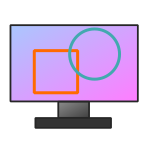
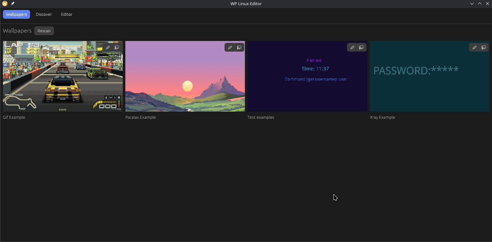
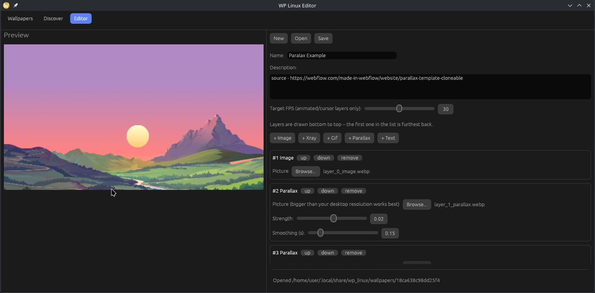
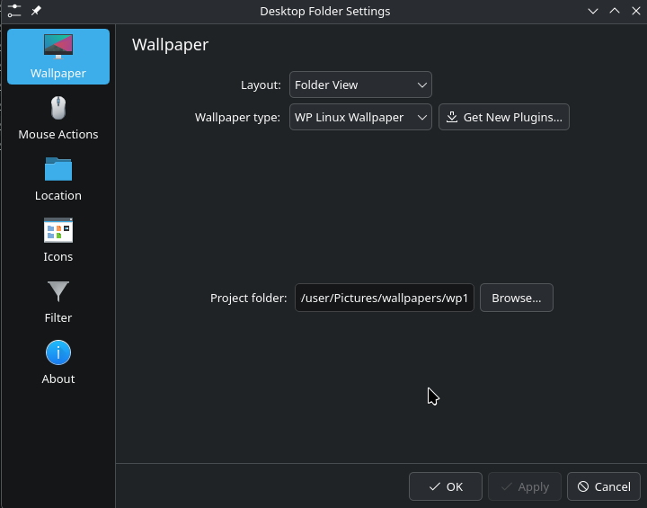

# WP Linux

*[Read in English](README.md)*

<p align="center">
  
</p>

Анимированные, интерактивные обои для Linux -- альтернатива Wallpaper Engine
для **KDE Plasma 6 на Wayland (KWin)**. Собираете стек слоёв (статичные
картинки, зацикленные GIF, реагирующие на курсор оверлеи "xray"/parallax) в
небольшом редакторе с GPU-превью, а затем запускаете это как обои рабочего
стола.

## Скриншоты

<p align="center">
  
  
  
</p>

Слой parallax в действии, реагирует на курсор на настоящем рабочем столе:

[paralax_preview.webm](https://github.com/user-attachments/assets/04d47d50-a1a5-4c80-b399-aed54b54ba50)

<p align="center"><sub>
Арт в демонстрации parallax выше взят из
<a href="https://webflow.com/made-in-webflow/website/parallax-template-cloneable">шаблона Webflow parallax</a>,
используется здесь только для демонстрации -- это не оригинальная работа, все права принадлежат авторам.
</sub></p>

## Статус

Ранняя стадия, одна платформа: только **KDE Plasma 6 + KWin/Wayland**.
Ничего другого (X11, GNOME, другие компоузеры) не поддерживается и пока не
планируется.

## Возможности

- **Image**-слои -- статичная картинка.
- **Gif**-слои -- зацикленная анимация, тайминг берётся из собственных
  задержек кадров gif-файла.
- **Xray**-слои -- базовая картинка, поверх которой в круге вокруг курсора
  показывается вторая, с использованием настоящей глобальной позиции
  курсора от компоузера (работает корректно даже под иконками рабочего
  стола, которые иначе перехватывали бы hover у обычного окна).
- **Parallax**-слои -- картинка, смещающаяся в противоположную от курсора
  сторону, имитируя глубину; можно накладывать несколько слоёв с разной
  силой эффекта для полноценного parallax. Автоматически масштабируется
  ровно настолько, чтобы ни один край никогда не оголялся, независимо от
  размера исходной картинки.
- Слои композитятся снизу вверх с альфа-блендингом на GPU (wgpu, Vulkan
  или GL).
- Рендер автоматически замирает на последнем кадре, когда система
  переключается в режим энергосбережения (через `power-profiles-daemon`), и
  возобновляется при выходе из него -- ничего не нужно ставить на паузу
  вручную.
- На ноутбуках с гибридной графикой предпочитается встроенный GPU вместо
  "спящего" дискретного -- это позволяет избежать пробуждения на сотни
  миллисекунд на каждом кадре.
- В `wp_linux_editor` живое GPU-превью построено на том же самом компоузере и тех же
  шейдерах, что использует `render-server` в проде, а не на отдельной
  повторной реализации -- анимация gif и реакция xray на курсор выглядят
  так же, как будет выглядеть итоговый результат, уже во время редактирования.

## Из чего состоит

| Компонент | Что делает |
|---|---|
| `crates/project-format` | Общая схема `project.json` (слои + целевой fps) -- формат хранения проекта обоев на диске. |
| `crates/player` | Общая библиотека GPU-компоузера (`SceneRenderer`), используется всем, что ниже, плюс собственный отдельный тестовый бинарник Wayland/layer-shell. |
| `crates/render-server` | Основной рантайм-рендерер: headless-процесс wgpu, который отдаёт скомпонованные кадры плагину Plasma по локальному HTTP, получает позицию курсора по D-Bus и следит за профилем питания. |
| `crates/wp_linux_editor` | Десктопное приложение (egui) для сборки и редактирования проектов обоев, с живым превью. |
| `plasma/plasma-plugin` | Плагин "Wallpaper" для Plasma, который вы выбираете в системных настройках; общается с `render-server`. |
| `plasma/kwin-script` | Скрипт KWin, пересылающий настоящую глобальную позицию курсора в `render-server` по D-Bus. |

## Требования

- KDE Plasma 6 на Wayland (KWin).
- GPU с поддержкой Vulkan или OpenGL/EGL.
- `kpackagetool6` (идёт вместе с Plasma) для установки двух пакетов KDE ниже.
- Опционально: `power-profiles-daemon` -- для автоматической заморозки в
  режиме энергосбережения; без него `render-server` просто всегда рендерит
  непрерывно.
- Для сборки из исходников: свежий стабильный тулчейн Rust (edition 2024).

## Установка

### Вариант A: скрипт установки (любой дистрибутив)

Скачивает последний архив релиза и настраивает всё внутри `$HOME` --
бинарники в `~/.local/bin`, два пакета KDE через `kpackagetool6`,
включённый скрипт KWin, и `render-server`, зарегистрированный на
автозапуск через XDG autostart `.desktop`-файл (`~/.config/autostart/`),
чтобы он запускался автоматически вместе с графической сессией -- без
зависимости от systemd. Позже это переключается прямо в `wp_linux_editor`
чекбоксом "Launch at login" на вкладке Wallpapers.

```sh
curl -fsSL https://github.com/AzimovIz/WP_Linux/releases/latest/download/install.sh | bash
```

Чтобы позже всё удалить:

```sh
curl -fsSL https://github.com/AzimovIz/WP_Linux/releases/latest/download/uninstall.sh | bash
```

(Сохранённые проекты обоев ни один из скриптов не трогает.)

Скрипт установки также скачивает несколько [примеров обоев](https://github.com/AzimovIz/WP_Linux/releases/tag/WallpaperExamples)
в `~/.local/share/wp_linux/wallpapers/`, чтобы сразу было из чего выбрать в
**WP Linux Wallpaper**. Этот же архив можно скачать и распаковать в ту же
папку вручную.

### Вариант B: Arch Linux / AUR

`packaging/archlinux/PKGBUILD` упаковывает тот же архив релиза для
общесистемной установки через `pacman` (бинарники в `/usr/bin`, пакеты KDE
в `/usr/share`). После установки выполните шаги для конкретного
пользователя, которые пакет выведет в консоль (включение скрипта KWin и
пользовательского сервиса `render-server`) -- это не может произойти
автоматически на этапе установки от root.

### Вариант C: сборка из исходников

```sh
git clone https://github.com/AzimovIz/WP_Linux.git
cd WP_Linux
cargo build --release --workspace
```

Бинарники окажутся в `target/release/`. Установите пакеты KDE, указав
`kpackagetool6` прямо на директории:

```sh
kpackagetool6 --type=Plasma/Wallpaper --install plasma/plasma-plugin/package
kpackagetool6 --type=KWin/Script --install plasma/kwin-script/package
```

(При запуске из исходников `render-server` также умеет сам подгрузить
скрипт KWin при старте -- установка вручную всё равно работает и в любом
случае надёжнее.)

## Использование

1. Запустите `wp_linux_editor`, соберите стек слоёв (Image / Gif / Xray / Parallax)
   и сохраните его как папку проекта.
2. Убедитесь, что `render-server` запущен (скрипт установки настраивает его
   как фоновый сервис; при сборке из исходников запустите вручную).
3. Правый клик по рабочему столу -> **Настроить рабочий стол и обои** (или
   **Параметры системы -> Внешний вид -> Обои**), выберите **WP Linux
   Wallpaper** и укажите папку сохранённого проекта. У каждого монитора в
   Plasma своя собственная настройка обоев, поэтому разные экраны можно
   направить на совершенно разные проекты (например, parallax на одном,
   xray на другом).

## Известные ограничения

- Отдельный standalone-рендерер Wayland из `player` растягивает слои на
  весь экран без сохранения пропорций, в отличие от `render-server`
  (именно его на практике использует плагин Plasma для отображения). Также
  он по-прежнему использует одну общую позицию курсора для всех выводов,
  на которые рисует, в отличие от `render-server`, который отслеживает
  проект и курсор для каждого монитора независимо.

## Лицензия

[MIT](LICENSE)
